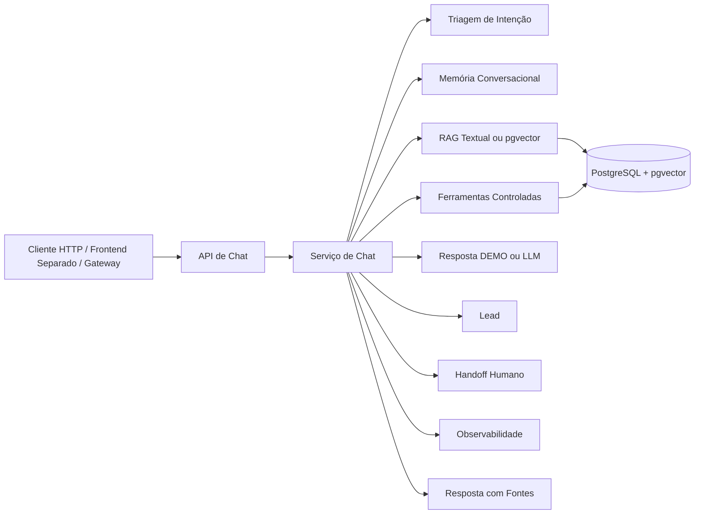

# Arquitetura

## Visão Executiva

O `opiagile-ai-rag-core` é o core de RAG da Opiagile. Ele demonstra entrada por API de chat, ingestão de documentos, recuperação com fontes, geração conversacional opcional por LLM, memória conversacional, triagem de intenção, lead, handoff humano, observabilidade e contrato HTTP para clientes externos.

A arquitetura foi desenhada para rodar localmente sem chaves reais, habilitar LLM real por configuração e usar embeddings reais com PostgreSQL/pgvector quando `OPENAI_EMBEDDINGS_ENABLED=true`.

## Posicionamento Técnico

Frase padrão:

> Core RAG com fontes, fallback textual local, pgvector com embeddings reais quando configurado e modo local sem chave externa.

Estado atual:

- Portfólio técnico público e validado localmente.
- Interface gráfica removida do core e documentada em `docs/frontend-handoff.md` para criação de frontend separado.
- Resposta conversacional por LLM validada com OpenAI quando `OPENAI_API_KEY` está configurada.
- Recuperação RAG textual/local como fallback.
- Embeddings reais com OpenAI e recuperação pgvector quando configurados.
- Piloto WhatsApp Cloud API preservado como referência para futura extração.
- Primeiro envio real WhatsApp com tester, demo pública aberta e produção continuam fora do foco deste core.

## Fluxo De Alto Nível

## Canais

- Web/API, frontend separado e gateways: `POST /api/chat`.
- Frontend separado: deve consumir a API conforme `docs/frontend-handoff.md`.
- WhatsApp mock e Cloud API piloto: preservados como referência técnica, não como foco evolutivo do core.
- Contrato para gateways: [`docs/gateway-contract.md`](docs/gateway-contract.md).

## Ferramentas Controladas

O core possui uma camada de tools por tenant/workspace. A primeira ferramenta é `SQL_READ_ONLY`, com allowlist de tabelas, limite de linhas e log de execução. O chat pode usar resultados de consultas pré-aprovadas para responder perguntas operacionais simples sobre a base de conhecimento, como documentos indexados, trechos por documento e consultas recentes.

A LLM não recebe credenciais e não executa SQL livre. Quando o planner LLM está habilitado, ele só escolhe entre ações permitidas; o backend decide as consultas reais, valida pelo guard read-only e entrega apenas o resultado como contexto factual.

## Documentação Técnica

A visão técnica detalhada fica em [`docs/architecture.md`](docs/architecture.md).
