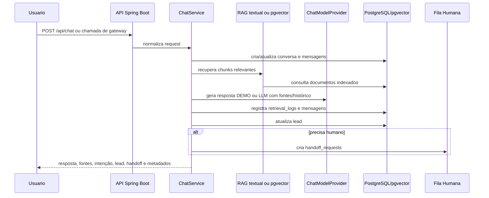

# Arquitetura Técnica

## Visão Geral

O projeto é uma API Spring Boot reposicionada como `opiagile-ai-rag-core`: um core de RAG com fontes, geração conversacional opcional por LLM, memória conversacional, triagem, lead, handoff humano, observabilidade local e contrato HTTP para clientes externos.

A interface gráfica foi removida deste repositório. O contrato para criar um frontend separado está em [`frontend-handoff.md`](frontend-handoff.md).

## Estado Atual Do RAG

O RAG atual é demonstrável, auditável e tem dois modos de recuperação:

- textual/local, usado no modo sem chave externa e como fallback;
- pgvector, usado quando embeddings reais são gerados e persistidos.

Fluxo atual:

1. Upload TXT em `POST /api/documents/upload`.
2. Chunking do conteúdo.
3. Persistência em `documents` e `document_chunks`.
4. Geração opcional de embeddings reais durante a ingestão.
5. Recuperação textual/local ou pgvector sobre chunks indexados.
6. Retorno de fontes na resposta da API.
7. Geração de resposta por `ChatModelProvider`:
   - `DEMO`, sem chave externa;
   - `OPENAI`, quando `CHAT_RESPONSE_MODE=LLM`, `LLM_PROVIDER=OPENAI` e `OPENAI_API_KEY` estão configurados.
8. Registro de retrieval, modo de resposta, provider, modelo, fallback e trace por conversa.

O schema possui extensão `vector`, coluna `document_chunks.embedding vector(1536)` e índice vetorial. Na v0.6, `OpenAiEmbeddingProvider` gera embeddings reais quando `OPENAI_EMBEDDINGS_ENABLED=true` e `OPENAI_API_KEY` está configurada. A recuperação tenta pgvector primeiro quando a consulta possui embedding; se não houver vetor ou resultado, volta para busca textual local.

## Fluxo Principal

## Módulos

- `document`: upload TXT, chunking, embeddings opcionais e persistência de documentos.
- `rag`: recuperação textual/local, embeddings OpenAI opcionais, pgvector e logs de retrieval.
- `chat`: orquestra conversa, RAG, geração DEMO/LLM, lead e handoff.
- `conversation`: histórico, resumo e memória básica.
- `lead`: intenção, extração simples e qualificação.
- `handoff`: fila operacional humana.
- `webhook`: piloto preservado de canal WhatsApp, mantido como referência técnica para extração futura.
- `observability`: trace por conversa.
- `frontend-handoff`: documentação de contrato para interface visual em repositório separado.

## WhatsApp

O módulo WhatsApp existente fica congelado como referência de piloto controlado. A evolução recomendada é extrair canal para uma aplicação separada, por exemplo `opiagile-whatsapp-ai-gateway`, consumindo o contrato em [`gateway-contract.md`](gateway-contract.md).

O piloto preservado suporta três níveis:

- `MOCK`: local, sem credenciais.
- `META_CLOUD` dry-run: valida payload, assinatura, allowlist e rate limit, mas não envia mensagem real.
- `META_CLOUD` envio real controlado: exige credenciais, HTTPS público, assinatura válida, número autorizado, `WHATSAPP_SEND_ENABLED=true` e `WHATSAPP_DRY_RUN=false`.

O primeiro teste real com tester autorizado ainda é uma etapa operacional pendente. O piloto não deve ser tratado como produção nem como responsabilidade principal deste core RAG.

## Decisões

- O modo demonstração funciona sem chaves externas.
- A geração com LLM é opcional por variáveis de ambiente.
- Core RAG com fontes, fallback textual local, pgvector com embeddings reais quando configurado e modo local sem chave externa.
- Providers externos ficam atrás de interfaces para evitar acoplamento com fornecedor.
- Integração de canais deve acontecer em gateways externos sempre que possível.
- Produção real exigiria revisão de segurança, LGPD, monitoramento, backup, retenção de dados e operação.
