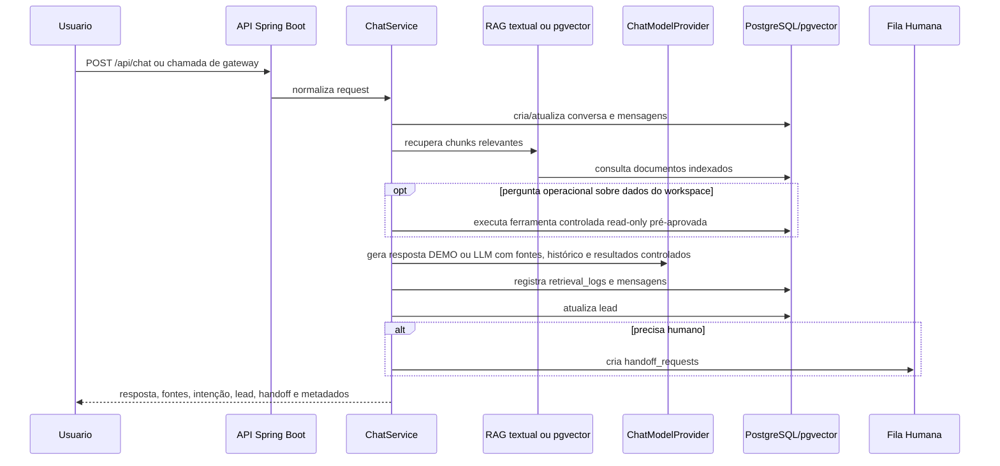

# Arquitetura Técnica

## Visão Geral

O projeto é uma API Spring Boot reposicionada como `opiagile-ai-rag-core`: um core de RAG com fontes, geração conversacional opcional por LLM, memória conversacional, triagem, lead, handoff humano, observabilidade local e contrato HTTP para clientes externos.

A interface gráfica foi removida deste repositório. O contrato para criar um frontend separado está em [`frontend-handoff.md`](frontend-handoff.md).

## Estado Atual Do RAG

O RAG atual é demonstrável, auditável e tem dois modos de recuperação:

- textual/local, usado no modo sem chave externa e como fallback;
- pgvector, usado quando embeddings reais são gerados e persistidos.

Fluxo atual:

1. Upload TXT em `POST /api/documents/upload`.
2. Chunking do conteúdo.
3. Persistência em `documents` e `document_chunks`.
4. Geração opcional de embeddings reais durante a ingestão.
5. Recuperação textual/local ou pgvector sobre chunks indexados.
6. Retorno de fontes na resposta da API.
7. Geração de resposta por `ChatModelProvider`:
   - `DEMO`, sem chave externa;
   - `OPENAI`, quando `CHAT_RESPONSE_MODE=LLM`, `LLM_PROVIDER=OPENAI` e `OPENAI_API_KEY` estão configurados.
8. Registro de retrieval, modo de resposta, provider, modelo, fallback e trace por conversa.

O schema possui extensão `vector`, coluna `document_chunks.embedding vector(1536)` e índice vetorial. Na v0.6, `OpenAiEmbeddingProvider` gera embeddings reais quando `OPENAI_EMBEDDINGS_ENABLED=true` e `OPENAI_API_KEY` está configurada. A recuperação tenta pgvector primeiro quando a consulta possui embedding; se não houver vetor ou resultado, volta para busca textual local.

## Fluxo Principal



## Módulos

- `document`: upload TXT, chunking, embeddings opcionais e persistência de documentos.
- `rag`: recuperação textual/local, embeddings OpenAI opcionais, pgvector e logs de retrieval.
- `chat`: orquestra conversa, RAG, ferramentas controladas, geração DEMO/LLM, lead e handoff.
- `conversation`: histórico, resumo e memória básica.
- `lead`: intenção, extração simples e qualificação.
- `handoff`: fila operacional humana.
- `security`: API keys tenant-aware, escopos, rate limit e compatibilidade com tokens de demo.
- `webhook`: piloto preservado de canal WhatsApp, mantido como referência técnica para extração futura.
- `observability`: trace por conversa.
- `config/OpenAPI`: especificação OpenAPI, console Swagger customizado e portal `/developers`.
- `frontend-handoff`: documentação de contrato para interface visual em repositório separado.

## Segurança E Autorização

A v0.10 adiciona API clients tenant-aware para gateways e aplicações externas. Cada client possui:

- tenant/workspace vinculado;
- hash SHA-256 da API key;
- prefixo curto para identificação operacional;
- lista de escopos;
- status `ACTIVE` ou `REVOKED`;
- rate limit por minuto.

O filtro `ApiClientAuthenticationFilter` autentica chamadas com `X-OPIAGILE-API-KEY` ou `Authorization: Bearer`, valida escopo por endpoint, aplica rate limit em memória e injeta o contexto autenticado. Quando esse contexto existe, `TenantContextResolver` usa o tenant/workspace da credencial e ignora headers livres.

Escopos atuais:

- `chat:write`;
- `documents:read`;
- `documents:upload`;
- `conversations:read`;
- `observability:read`;
- `handoffs:read`;
- `handoffs:write`;
- `tools:read`;
- `tools:execute`;
- `workspaces:read`.

Para compatibilidade, `API_SECURITY_REQUIRE_API_KEY=false` mantém o modo legado local. Em ambiente exposto ou multiempresa, a configuração recomendada é `API_SECURITY_REQUIRE_API_KEY=true`.

Essa camada não é login de usuário final. Se o projeto evoluir para painel administrativo multiusuário, a recomendação é adicionar autenticação OIDC/JWT e RBAC por papel, mantendo as API keys para gateways server-to-server.

A v0.11 adiciona auditoria operacional em `api_client_usage_logs`. O filtro registra eventos permitidos e bloqueados com client, tenant/workspace, endpoint, escopo, status HTTP, motivo de bloqueio, IP, user agent e latência. API keys e payloads não são registrados. O endpoint administrativo `GET /api/admin/api-clients/usage` retorna resumo por client e eventos recentes mediante token administrativo.

## Portal De Desenvolvedores

O core expõe uma camada de documentação interativa para integração:

- `GET /developers`: portal visual com proposta da API, exemplos e instrução de autenticação;
- `GET /developers/console`: redirecionamento para o console Opiagile com navegação lateral;
- `GET /developers/api-console/index.html`: console próprio que consome OpenAPI e executa endpoints;
- `GET /developers/swagger-ui/index.html`: console Swagger embutido em página Opiagile, preservado como fallback técnico;
- `GET /v3/api-docs/rag-core`: especificação OpenAPI do grupo público de integração.

O grupo `rag-core` documenta endpoints úteis para apps, gateways e empresas consumidoras:

- chat;
- documentos;
- workspaces;
- conversas;
- observabilidade;
- handoffs;
- ferramentas controladas;
- versão.

Endpoints administrativos, site-chat interno e webhooks de canal ficam fora desse grupo para reduzir ruído e evitar exposição desnecessária no console comercial.

O console Opiagile aceita `X-OPIAGILE-API-KEY` em campo próprio e mantém o valor apenas em `sessionStorage`. O Swagger clássico aceita a mesma chave pelo botão `Authorize`. A chave continua sendo responsabilidade do consumidor e não deve ser colocada em frontend público. A documentação interativa pode ser desligada por ambiente com:

```text
OPENAPI_ENABLED=false
OPENAPI_UI_ENABLED=false
```

## Ferramentas Controladas

Ferramentas são cadastradas por tenant/workspace em `external_tools`. A execução gera auditoria em `external_tool_execution_logs`.

Na versão atual, `base-conhecimento-readonly` permite consultas read-only pré-aprovadas sobre `documents`, `document_chunks` e `retrieval_logs`. O `ControlledToolPlanner` usa essa ferramenta para perguntas como:

- quantos documentos existem no workspace;
- quais documentos estão indexados;
- quantos trechos existem por documento;
- quais consultas recentes foram registradas.

O usuário final não envia SQL no chat. O planner constrói consultas conhecidas, o `SqlReadOnlyGuard` valida tabelas e comandos permitidos, e o resultado entra no prompt como contexto factual adicional.

Quando `TOOLS_PLANNER_LLM_ENABLED=true`, o `OpenAiToolPlanProvider` pode classificar perguntas operacionais menos literais em uma ação permitida. A resposta aceita do planner é restrita a JSON com `DOCUMENT_COUNT`, `DOCUMENT_LIST`, `CHUNK_STATS`, `RECENT_RETRIEVALS` ou `NONE`; qualquer baixa confiança, ação desconhecida ou JSON inválido vira `NONE`.

## WhatsApp

O módulo WhatsApp existente fica congelado como referência de piloto controlado. A evolução recomendada é extrair canal para uma aplicação separada, por exemplo `opiagile-whatsapp-ai-gateway`, consumindo o contrato em [`gateway-contract.md`](gateway-contract.md).

O piloto preservado suporta três níveis:

- `MOCK`: local, sem credenciais.
- `META_CLOUD` dry-run: valida payload, assinatura, allowlist e rate limit, mas não envia mensagem real.
- `META_CLOUD` envio real controlado: exige credenciais, HTTPS público, assinatura válida, número autorizado, `WHATSAPP_SEND_ENABLED=true` e `WHATSAPP_DRY_RUN=false`.

O primeiro teste real com tester autorizado ainda é uma etapa operacional pendente. O piloto não deve ser tratado como produção nem como responsabilidade principal deste core RAG.

## Decisões

- O modo demonstração funciona sem chaves externas.
- A geração com LLM é opcional por variáveis de ambiente.
- Core RAG com fontes, fallback textual local, pgvector com embeddings reais quando configurado e modo local sem chave externa.
- Providers externos ficam atrás de interfaces para evitar acoplamento com fornecedor.
- Integração de canais deve acontecer em gateways externos sempre que possível.
- Produção real exigiria revisão de segurança, LGPD, monitoramento, backup, retenção de dados e operação.
